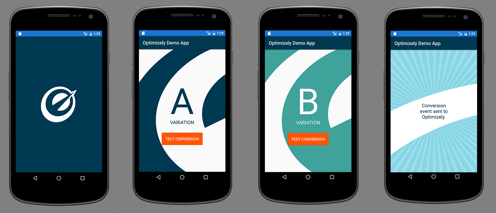

# Optimizely X Android SDK Demo App

This module houses the demo app used to demonstrate how to get started with the Android SDK. The app
is also used to run integration tests with the Android Espresso framework.

## Experiments Run

We run the following experiment:
  - Background change in second activity, which is loaded after the splash screen.

## How it works

The SDK is implemented in the following way:
  - The splash screen initializes the Optimizely manager asynchronously. This starts the datafile
  fetch.
  - Once the datafile is fetched and the Optimizely manager is started, we grab the `optimizelyClient`
  from the manager and use it to activate the experiment named `background_experiment`. This buckets the user and sends
  an impression event.
  - We then use the bucketed variation to determine which activity to show. `VariationAActivity` for
  `variation_a`, `VariationBActivity` for `variation_b`, or `ActivationErrorActivity` for the control.
  - Each of the variation activities includes a `Test Conversion` button.
  - Clicking on that button will call `optimizelyClient.track()` and send a conversion event for the
  event named `sample_conversion`.
  - Then the application will navigate to the conversion page to confirm that a conversion event has
  been sent.

## Running the test app

Run `./gradlew test-app:connectedAndroidTest` to run the Espresso tests.

